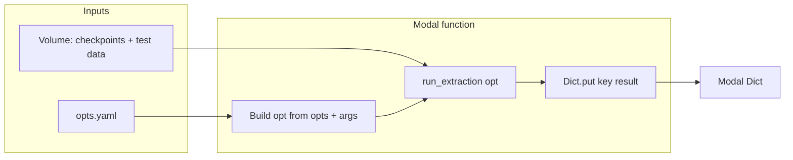

# Kế hoạch: test_modal.py – extraction trên Modal, output vào Modal Dict

## Bối cảnh

- [baseline/test.py](baseline/test.py): load opts.yaml + CLI, load model, build dataloaders (từ `test_dir`), extract query/gallery features, ghi `pytorch_result_{mode}.mat`.
- [baseline/train_modal.py](baseline/train_modal.py): image (baseline code + deps), volume, `_opts_to_args(opts.yaml)` để chạy train.py qua subprocess.
- Yêu cầu: cùng luồng extraction nhưng chạy trên Modal; tham số test (`name`, `checkpoint`, `test_dir`, `batchsize`) là argument của Modal function (sửa trực tiếp trong code); vẫn đọc [baseline/opts.yaml](baseline/opts.yaml) để khớp kiến trúc; output ghi vào **Modal Dict**, không tạo file .mat. **Chỉ thực hiện mode 1** (drone→satellite). Test data và model đã có sẵn trên volume.

---

## 1. Chiến lược tham số và opts

- **opts.yaml**: Giữ cách dùng như train_modal — đọc từ `BASELINE_DIR/opts.yaml` trong container để lấy `backbone`, `head`, `h`, `w`, `block`, `num_worker`, `gpu_ids`, v.v. (khớp kiến trúc với checkpoint).
- **Tham số test**: Không dùng file .yaml riêng; dùng **argument của Modal function** (sửa trực tiếp trong code khi gọi/spawn). Gồm ít nhất:
  - `run_name`: tên run (đường dẫn checkpoint trên volume: `checkpoints/<run_name>/<checkpoint>`).
  - `checkpoint`: tên file checkpoint (vd. `net_best_epoch_116.pth`).
  - `test_dir`: đường dẫn **trong volume** tới thư mục test đã put (vd. `data/test` → full path `{DATA_VOLUME_MOUNT}/data/test`). Test data đã có sẵn trên volume (query_drone, gallery_satellite).
  - `batchsize`: batch size (vd. 128).
  - (Không dùng mode 2; chỉ mode 1 — drone→satellite.)
- Trong function: build một namespace `opt` = merge opts.yaml + các override trên (và `checkpoint` = full path tới file .pth trên volume).

---

## 2. Dữ liệu và volume

- **Checkpoint**: Đã có trên volume (cùng volume với train), path: `{DATA_VOLUME_MOUNT}/checkpoints/{run_name}/{checkpoint}`. Model/checkpoint đã sẵn trong workspace/volume.
- **Test data**: Đã put sẵn trên **cùng volume** (vd. `data/test`), cấu trúc: `test_dir/query_drone`, `test_dir/gallery_satellite` (chỉ mode 1). Chỉ cần truyền đúng argument `test_dir` (path trong volume) khi gọi function.

---

## 3. Tái sử dụng logic từ test.py

Hai hướng:

- **A (đề xuất)**
  - Trong [baseline/test.py](baseline/test.py) thêm một hàm, ví dụ `run_extraction(opt)`, thực hiện toàn bộ luồng: load model (`load_network(opt)`), build transforms/datasets/dataloaders **chỉ cho mode 1** (query_drone, gallery_satellite) theo `opt.test_dir`, gọi `extract_feature`/`get_id`/`which_view`, và **trả về** dict `result` (cùng format: `gallery_f`, `gallery_label`, `gallery_path`, `query_f`, `query_label`, `query_path`) **không** gọi `savemat`.
  - Phần `if __name__ == "__main__"` hiện tại gọi hàm đó rồi `savemat('pytorch_result_1.mat', result)`.
  - [test_modal.py](baseline/test_modal.py) chỉ: build `opt` từ opts.yaml + argument Modal, gọi `run_extraction(opt)`, ghi `result` vào Modal Dict.
- **B**
  - Không sửa test.py; trong test_modal.py copy/import và chạy toàn bộ logic (load_network, transforms, datasets, extract_feature, get_id). Cần đảm bảo mọi chỗ dùng `opt` (vd. `opt.block` trong `extract_feature`) nhận đúng namespace (vd. inject vào module test nếu import từ test).

Kế hoạch mặc định chọn **A** để tránh trùng lặp và dễ bảo trì.

---

## 4. Modal Dict – cách lưu kết quả

- Dùng **named Dict** (persist), ví dụ `modal.Dict.from_name("denseuav-test-results", create_if_missing=True)`.
- Value cần lưu: dict giống `result` trong test.py: numpy arrays (`gallery_f`, `query_f`) và list (`gallery_label`, `gallery_path`, `query_label`, `query_path`). Modal Dict serialize bằng cloudpickle; numpy và list đều dùng được.
- Key: dùng một key per run để tránh ghi đè, ví dụ `f"{run_name}_mode_1"` (chỉ mode 1). Có thể lưu thêm metadata (vd. `test_dir`, `checkpoint`, timestamp) trong một dict con nếu cần.

---

## 5. Cấu trúc file test_modal.py (dự kiến)

- **Vị trí**: [baseline/test_modal.py](baseline/test_modal.py) (cùng cấp với train_modal.py; chạy từ repo root: `modal run baseline/test_modal.py`).
- **Import**: modal, pathlib, os; có thể import từ baseline (sau khi `sys.path` hoặc cwd là BASELINE_DIR trong container).
- **Hằng số/volume**: Dùng chung volume name với train (vd. `denseuav-training`), `WORKSPACE`, `BASELINE_DIR`, `DATA_VOLUME_MOUNT`, `CHECKPOINT_DIR`; thêm `TEST_DATA_SUBPATH` hoặc nhận test_dir từ argument (path trong volume).
- **Helper build opt**: Đọc opts.yaml từ `BASELINE_DIR/opts.yaml` (cùng cách với train_modal: đọc YAML, setattr vào namespace), rồi override: `checkpoint` (full path trên volume), `test_dir`, `name`/`run_name`, `batchsize`, `num_worker` (nếu cần). Skip các key giống train (vd. `data_dir`, `use_gpu`, `nclasses`, `in_planes`) nếu không dùng cho test.
- **Image**: Có thể dùng chung image với train_modal (đã có torch, torchvision, PyYAML, baseline code); không cần wandb cho test. Nếu tách riêng image cho test thì bỏ wandb, giữ phần còn lại.
- **Modal function** (vd. `extract_on_modal`):
  - Argument: `run_name`, `checkpoint`, `test_dir` (path trong volume tới thư mục test đã put, vd. `"data/test"`), `batchsize`. Không cần argument `mode` (cố định mode 1).
  - Mount volume giống train.
  - `opts_path = BASELINE_DIR / "opts.yaml"`; build `opt`; `opt.checkpoint = str(Path(DATA_VOLUME_MOUNT) / "checkpoints" / run_name / checkpoint)`; `opt.test_dir = str(Path(DATA_VOLUME_MOUNT) / test_dir)`.
  - `os.chdir(BASELINE_DIR)` (và sys.path nếu cần) rồi gọi `run_extraction(opt)` (import từ baseline.test).
  - `result_dict = modal.Dict.from_name("denseuav-test-results", create_if_missing=True)`; `result_dict[key] = result` (key vd. `f"{run_name}_mode_1"`).
  - Không gọi `volume.commit()` cho Dict (Dict persist riêng); chỉ cần commit nếu có ghi file lên volume (ở đây không).
- **Local entrypoint** (vd. `main`): Nhận tham số (run_name, checkpoint, test_dir, batchsize), in ra cách đã set, gọi `extract_on_modal.remote(...)` hoặc `.spawn(...).get()`.

---

## 6. Refactor test.py (nếu chọn hướng A)

- Thêm hàm `run_extraction(opt)`:
  - Input: namespace `opt` (đã có đủ: checkpoint, test_dir, batchsize, h, w, block, num_worker, gpu_ids, ms, … từ opts.yaml + override).
  - Logic: giữ nguyên từ “Load model” đến “build result dict”; **chỉ mode 1**: image_datasets/dataloaders cho query_drone và gallery_satellite (load_network, eval, data_transforms, extract_feature, get_id, tạo dict `result`).
  - Return: `result` (dict với các key như hiện tại), **không** ghi file.
- Trong `if __name__ == "__main__"`: gọi `result = run_extraction(opt)` rồi `scipy.io.savemat('pytorch_result_1.mat', result)` (và ghi gallery_name.txt / query_name.txt nếu vẫn cần).

---

## 7. Checklist triển khai

1. **test.py**: Thêm `run_extraction(opt)`; phần **main** gọi `run_extraction(opt)` và savemat.
2. **test_modal.py**:

- Image (dùng chung hoặc tách), volume, app.
- Helper load opts.yaml vào namespace + override (checkpoint full path, test_dir, run_name, batchsize).
- Function `extract_on_modal(run_name, checkpoint, test_dir, batchsize)`; build opt; chdir BASELINE_DIR; gọi `run_extraction(opt)`; ghi vào `modal.Dict.from_name(...)` với key vd. `f"{run_name}_mode_1"`.
- Local entrypoint với cùng tham số; docstring ghi rõ: test data và model đã có trên volume, chỉ cần truyền đúng `test_dir` và `run_name`/`checkpoint`; tên Dict và key format.

1. **Docstring/README**: Ghi rõ: tham số function (sửa trực tiếp trong code); test data và checkpoint đã trên volume; Dict name và key format; cách đọc lại từ Dict (get key để dùng downstream, vd. evaluate_gpu nếu sau này hỗ trợ đọc từ Dict).

---

## 8. Lưu ý

- **torch.load**: Trong container cần truyền **absolute path** tới checkpoint trên volume để không phụ thuộc cwd.
- **extract_feature(opt.block)**: Khi dùng `run_extraction(opt)` từ test.py, `opt` đã có `block` từ opts.yaml, không cần sửa thêm.
- **Chỉ mode 1**: Không hỗ trợ mode 2. `run_extraction(opt)` và test_modal chỉ build image_datasets/dataloaders cho query_drone và gallery_satellite (giống cấu trúc test.py hiện tại).
