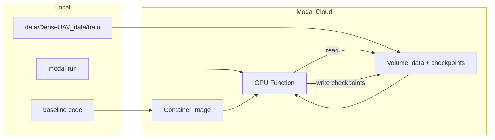

# Kế hoạch: Training DenseUAV trên Modal GPU

## Mục tiêu

- Chạy [baseline/train.py](baseline/train.py) trên GPU của Modal (A100/H100 hoặc tương đương) thay vì máy local không có CUDA.
- Data và checkpoints nằm trên Modal Volume để persist và có thể resume.
- Chạy bằng một lệnh (vd. `modal run train_modal.py`) sau khi đã upload data.

## Kiến trúc tổng quan

- **Container image**: PyTorch (CUDA) + dependencies + copy code baseline vào container.
- **Volume**: 1 Volume (vd. `denseuav-training`) chứa thư mục `data/train` (dataset) và `checkpoints/` (output). Mount vào function tại path cố định (vd. `/workspace`).
- **GPU function**: chạy training (subprocess gọi `train.py` với `--data_dir` và `--checkpoint_dir` trỏ vào path trên Volume), có retries và timeout 24h nếu cần job dài.

## Các bước thực hiện

### 1. Cho phép checkpoint ghi ra thư mục cấu hình được (để trỏ vào Volume trên Modal)

Hiện tại mọi thứ cố định `./checkpoints/`. Cần thêm một “root” cấu hình được.

- **[baseline/train.py](baseline/train.py)**
  - Trong `get_parse()`: thêm argument `--checkpoint_dir` (default `./checkpoints`).
  - Trong `train_model()`: dùng `opt.checkpoint_dir` cho path log file (thay vì hardcode `"checkpoints/{}/train.log"`).
  - Khi gọi `save_network(..., opt)`: truyền thêm `opt` (hoặc ít nhất `opt.checkpoint_dir` và `opt.name`) để utils ghi đúng thư mục.
- **[baseline/tool/utils.py](baseline/tool/utils.py)**
  - `copyfiles2checkpoints(opt)`: thay `dir_name = os.path.join('checkpoints', opt.name)` bằng `dir_name = os.path.join(getattr(opt, 'checkpoint_dir', 'checkpoints'), opt.name)`.
  - `save_network(network, dirname, epoch_label, ...)`: thêm tham số (vd. `checkpoint_root=None`); nếu `None` thì dùng `'./checkpoints'`, không thì dùng `checkpoint_root`. Tạo và dùng `save_path = os.path.join(checkpoint_root, dirname, save_filename)` (và tạo thư mục tương ứng).
  - Đảm bảo mọi chỗ tạo thư mục đều dùng cùng root này.

Mục đích: trên Modal có thể chạy với `--data_dir /workspace/data/train --checkpoint_dir /workspace/checkpoints` (trong đó `/workspace` là mount point của Volume).

### 2. Tạo script Modal và định nghĩa image/volume/function

Tạo file mới (vd. **[baseline/train_modal.py](baseline/train_modal.py)** hoặc **train_modal.py** ở root repo) với nội dung theo pattern sau.

- **Image**
  - Base: `modal.Image.debian_slim(python_version="3.11")` (hoặc 3.12 nếu bạn dùng).
  - Cài PyTorch + torchvision (bản có CUDA): `pip_install("torch", "torchvision", "PyYAML")` (và bất kỳ dependency nào mà [baseline/train.py](baseline/train.py) cần mà không nằm trong package local; từ imports hiện tại cần torch, torchvision, yaml; các package khác nằm trong `baseline/`).
  - Đưa code baseline vào image: `image.add_local_dir("baseline", remote_path="/workspace/baseline")` (chạy từ repo root) hoặc tương đương nếu đặt script trong `baseline/`. Có thể dùng `ignore=[".git", "__pycache__", "*.pyc", ".DS_Store"]` để giảm kích thước.
  - Đảm bảo working directory khi chạy là `/workspace/baseline` (hoặc nơi chứa `train.py`) để imports (`from models...`, `from datasets...`) hoạt động.
- **Volume**
  - `volume = modal.Volume.from_name("denseuav-training", create_if_missing=True)`.
  - Mount vào function: `volumes={"/workspace": volume}`.
  - Cấu trúc trong Volume: `/workspace/data/train` (dataset), `/workspace/checkpoints` (output). User sẽ upload data vào Volume một lần (xem bước 4).
- **GPU function**
  - Decorator: `@app.function(image=..., volumes={"/workspace": volume}, gpu="A100", timeout=86400, retries=modal.Retries(max_retries=2))` (timeout 24h; retries tùy chọn).
  - Trong function:
    - Set `data_dir = "/workspace/data/train"`, `checkpoint_dir = "/workspace/checkpoints"`.
    - Chạy training bằng subprocess: `subprocess.run(["python", "train.py", "--data_dir", data_dir, "--checkpoint_dir", checkpoint_dir, "--name", run_name, ...], cwd="/workspace/baseline", env={**os.environ}, check=True)`.
    - Các flag khác lấy từ [baseline/opts.yaml](baseline/opts.yaml) (đọc bằng PyYAML trong function hoặc truyền qua env) để giữ hành vi giống local.
  - Sau khi subprocess thành công, gọi `volume.commit()` để đảm bảo checkpoints đã flush lên Volume.
- **Entrypoint**
  - `@app.local_entrypoint()`: nhận (optional) `run_name`, `config_path` (opts.yaml); gọi `train_modal_function.spawn(run_name, ...)` (hoặc `.remote`) và `.get()` để chờ kết quả.
  - Có thể in ra hướng dẫn upload data và đường dẫn Volume để user kiểm tra checkpoints trên Modal dashboard.

### 3. Đồng bộ CUDA khi chạy trên Modal

Trên Modal, `torch.cuda.is_available()` sẽ là True và container chỉ có 1 GPU. Để tránh lỗi tương tự local (khi từng gọi `set_device` với gpu_ids rỗng/không tương thích):

- Trong [baseline/train.py](baseline/train.py) (đã được đề xuất trước đó): chỉ gọi `torch.cuda.set_device(gpu_ids[0])` khi `use_gpu and len(gpu_ids) > 0`. Điều này vừa fix lỗi CPU-only local, vừa an toàn trên Modal (dùng GPU 0).

### 4. Upload data lên Modal Volume (one-time / khi đổi dataset)

- Từ máy local (đã cài Modal CLI và login):  
  `modal volume put denseuav-training data/train /Users/chibangnguyen/ayai/UAV/denseUAV_baseline/data/DenseUAV_data/train`  
  (hoặc đường dẫn thư mục train thực tế).
- Kiểm tra: `modal volume ls denseuav-training` để thấy cấu trúc `data/train/...`.

### 5. Chạy training và lấy checkpoints

- Chạy: `modal run baseline/train_modal.py` (hoặc `modal run train_modal.py` nếu file ở root), có thể kèm `--run-name baseline_run1`.
- Sau khi chạy xong, checkpoints nằm trong Volume tại `checkpoints/<run_name>/`.
- Tải về máy (nếu cần): `modal volume get denseuav-training checkpoints/baseline_run1/net_119.pth ./net_119.pth` (ví dụ), hoặc dùng Modal dashboard / Python SDK `vol.get_file()`.

### 6. (Tùy chọn) Training dài & resume

- Nếu muốn job dài hơn 24h hoặc resume sau khi bị cắt:
  - Tăng `retries` và dùng timeout 24h.
  - Trong [baseline/train.py](baseline/train.py) đã có `--load_from`; có thể để Modal function kiểm tra trong Volume xem đã có `checkpoints/<name>/net_*.pth` chưa, nếu có thì truyền `--load_from /workspace/checkpoints/<name>/net_XXX.pth` để resume.
  - Pattern tương tự [long-training example](https://github.com/modal-labs/modal-examples/blob/main/06_gpu_and_ml/long-training.py): checkpoint định kỳ + khi restart thì load checkpoint mới nhất.

## Thứ tự file cần chỉnh/sửa

| Thứ tự | File                                             | Thay đổi                                                                                                                                          |
| ------ | ------------------------------------------------ | ------------------------------------------------------------------------------------------------------------------------------------------------- |
| 1      | [baseline/train.py](baseline/train.py)           | Thêm `--checkpoint_dir`; dùng nó cho log path; chỉ `set_device` khi `use_gpu and len(gpu_ids) > 0`; truyền opt/checkpoint_dir vào `save_network`. |
| 2      | [baseline/tool/utils.py](baseline/tool/utils.py) | `copyfiles2checkpoints`: dùng `opt.checkpoint_dir`. `save_network`: thêm tham số checkpoint root và dùng cho đường dẫn lưu.                       |
| 3      | (mới) baseline/train_modal.py                    | Modal App: image (PyTorch + baseline code), Volume mount, GPU function (subprocess train.py), local_entrypoint.                                   |
| 4      | (doc/README)                                     | Ghi lại bước: tạo Volume, upload data, chạy `modal run`, tải checkpoints.                                                                         |

## Lưu ý

- **Chi phí**: Modal tính theo thời gian dùng GPU (vd. A100 theo giờ). Có thể chọn GPU rẻ hơn (T4, L4) để test, sau đó dùng A100/H100 cho chạy chính.
- **Bảo mật**: Không hardcode token Modal trong repo; dùng `modal token new` và biến môi trường / Modal CLI login.
- **opts.yaml**: Có thể đọc `opts.yaml` trong `train_modal.py` (từ `/workspace/baseline/opts.yaml` trong container) rồi build list argument cho `train.py` để đồng bộ config với local.

Sau khi triển khai xong, bạn chỉ cần: (1) upload data một lần, (2) chạy `modal run baseline/train_modal.py`, (3) đợi xong rồi lấy file `.pth` từ Volume.
